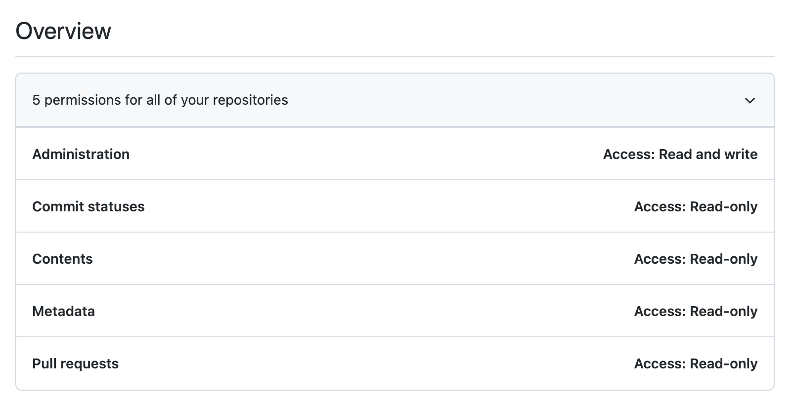

# Fork cleanup

⚠️ This project does destructive actions on your GitHub profile. Use at your own risk. ⚠️

This is a simple script to delete your forked repositories which have no additional commits. Because GitHub introduced additional limits to the free accounts, it makes sense to do some housekeeping.

## Setup

1. Create a [personal access token](https://github.com/settings/personal-access-tokens/new) with these permissions:



- Administration: Read and write
- Commit statuses: Read-only
- Contents: Read-only
- Metadata: Read-only
- Pull requests: Read-only

2. Add the token to your `.env` file as `GITHUB_ACCESS_TOKEN`.

3. Create a local virtual environment and install the requirements:

```sh
$ python3 -m venv venv
$ source venv/bin/activate
$ pip install -r requirements.txt
```

4. Run the script to see what repositories would be deleted:

```sh
$ python main.py
Logged in with cleanunicorn
Can delete cleanunicorn/forge-std
```

5. This is a destructive action. If you really want to delete the repositories, add the `--delete` flag:

```sh
$ python3 main.py --delete
Logged in with cleanunicorn
This will delete forks with no commits from the authenticated user. Are you sure? (y/n)
y
Deleting cleanunicorn/forge-std
Total forks:  32
Total forks with no commits by the authenticated user:  1
```
